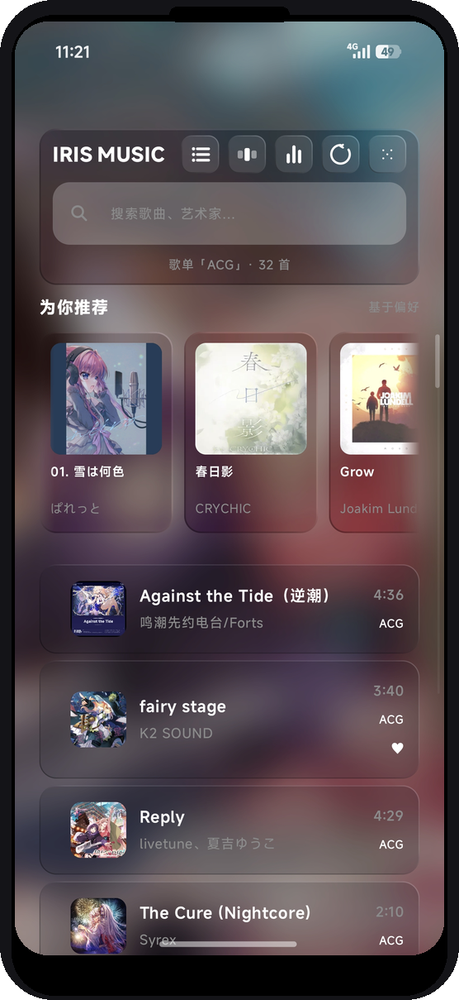
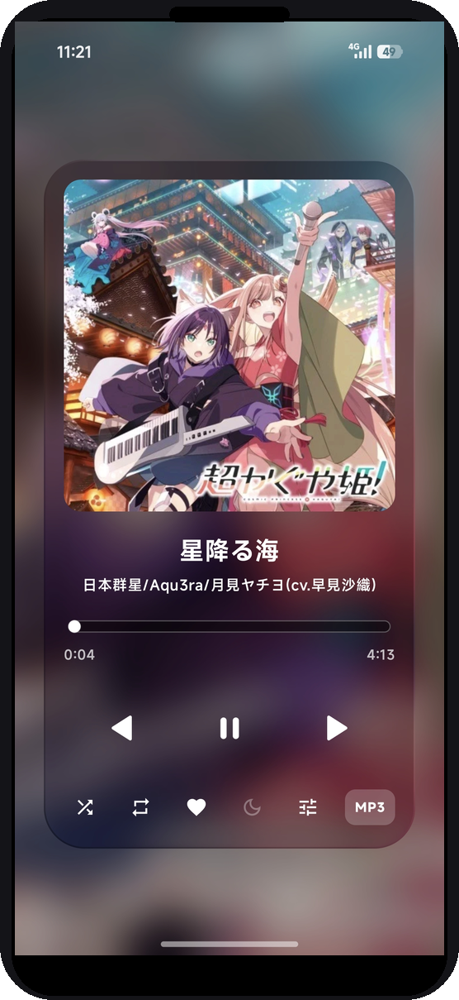
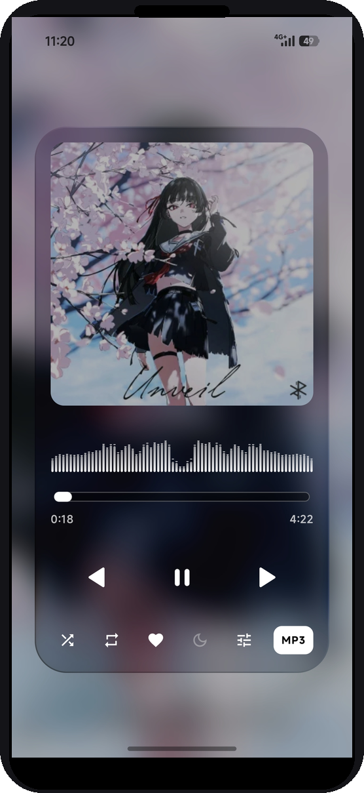
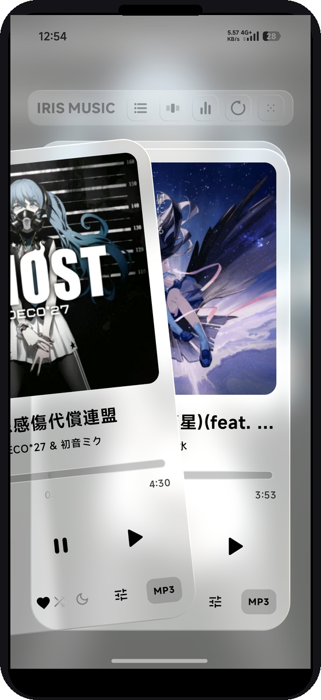
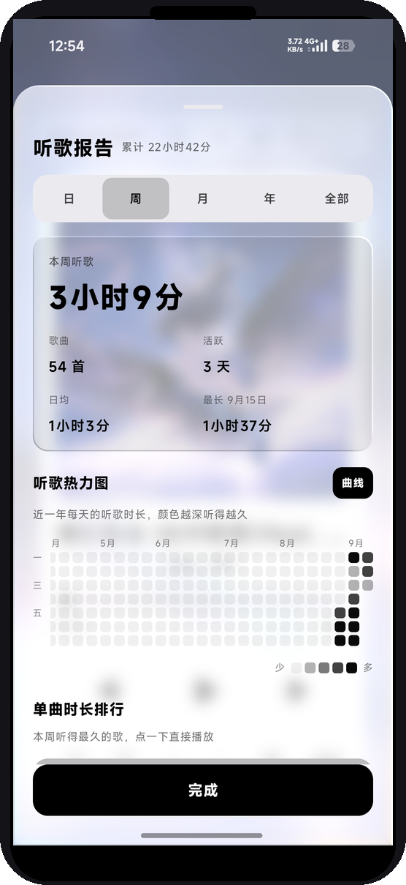

### 一个本地音乐播放器

真·折射液态玻璃 · 四种排布 · 可自定义配色 · 默认不联网 · 无账号

*做自己想用的播放器*

[English](README.en.md) · [功能](#-功能) · [安装](#-安装) · [许可](#%EF%B8%8F-许可) · [免责声明](REMIND.md)

---

IRIS Music 是个**个人项目**：没有团队、没有 KPI，也不商业化。它只做我想要的样子——把手机里的音乐用简单卡片铺开，数据全部留在本机。

> ⚠️ 请先阅读 [`REMIND.md`](REMIND.md)（许可与免责声明）。本软件按 **AS IS** 提供，**无任何担保**。

## ✨ 功能

| | |
|:--|:--|
| 🎨 **主题与材质** | 黑白 / 深海蓝 / 青草绿三套色彩，实色 / 毛玻璃 / 液态玻璃三种材质，外加取色器自定义主色 / 次色与深色 / 浅色 / 自动明暗。 |
| 🧠 **本地推荐算法** | 大多数本地播放器都没有的——基于点赞、播放次数、跳过、风格权重打分，对整个曲库独立算推荐度，还能调整「探索度」。 |
| 🧭 **一库四排** | 纵向 / 横向 / 堆叠 / 唱片墙。排布、配色、明暗、材质各自独立一维，任意组合、不硬编码。唱片墙交互灵感来自 [Folia](https://github.com/chthollyphile/folia-major)，已获原作者授权，使用自己的代码独立实现。 |
| ✨ **新奇功能** | 音律震动、听歌报告、各种增强的均衡器、果冻弹性动效…… |

> 🔒 **默认不上网。** 歌单、收藏、听歌统计全部只留在本机，安全、无广告、无遥测。唯一例外：设置里「检查更新」默认关闭，开启后手动点击才发起一次到 GitHub API 的版本号查询（单向 GET、不上传任何数据），关闭即完全不联网。

## 📸 截图

<table>
<tr>
<td align="center"> 歌单</td>
<td align="center"> 播放卡片</td>
<td align="center"> 播放卡片</td>
</tr>
<tr>
<td align="center"> 播放卡片 · 堆叠</td>
<td align="center"> 听歌报告</td>
<td></td>
</tr>
</table>

## 📥 安装

去 **[Releases](releases/latest)** 下载 `IRISMusic-v3.6.8-arm64-v8a.apk`（绝大多数近几年的手机，arm64），直接安装。

首次打开授予「读取音频」权限即可；若要用悬浮歌词，需在系统设置里手动授予「显示在其他应用上层」。

## ⚖️ 许可

Copyright © 2026 **WWRJ**.

本项目的**自有源码**在 **GNU General Public License v3.0**（[`LICENSE`](LICENSE)）下授权。简言之：**自由使用、修改、分发皆可；一旦你把修改版对外分发，整个衍生作品必须同样以 GPL-3.0 开源。** 详见 [`REMIND.md`](REMIND.md) 与 [`NOTICE`](NOTICE)。

本项目不含任何音乐内容；导入的音频由使用者自行负责。

Made with 🎧 by WWRJ
