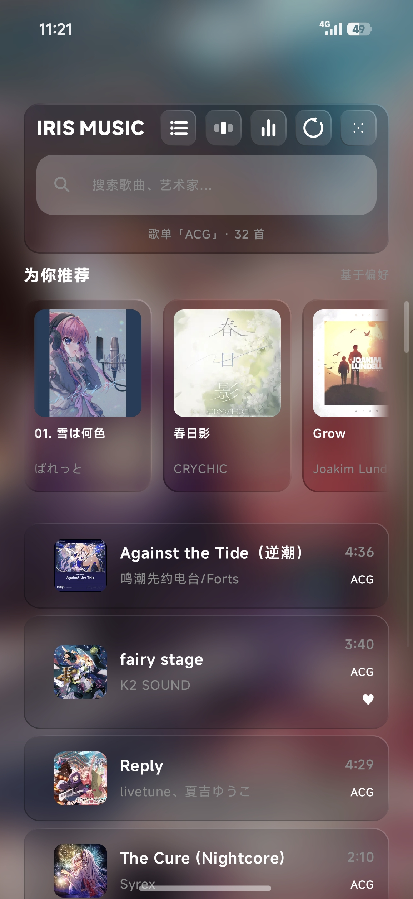
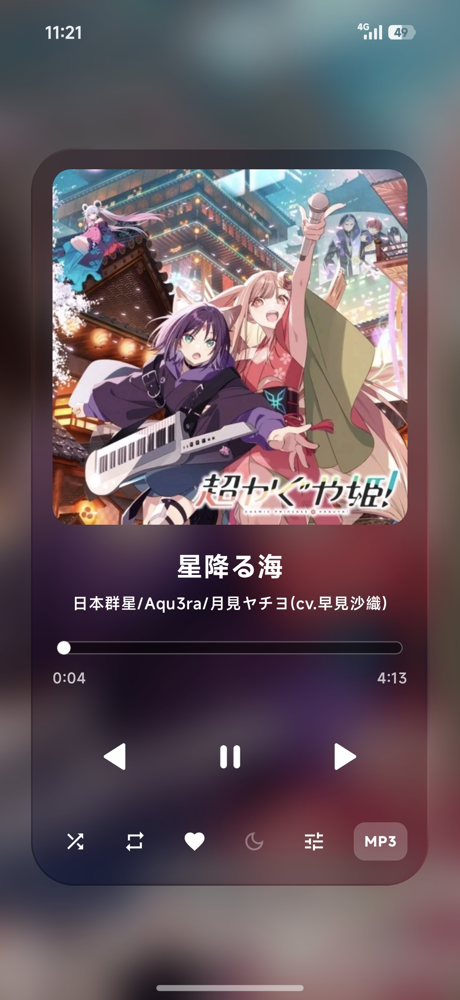
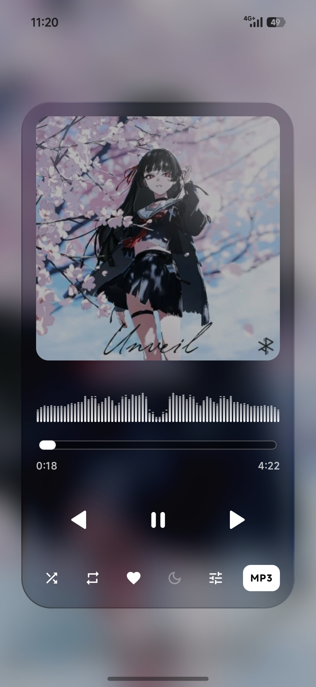
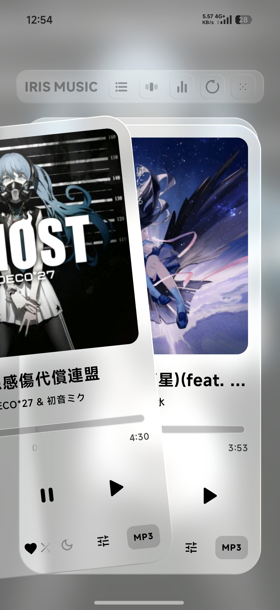
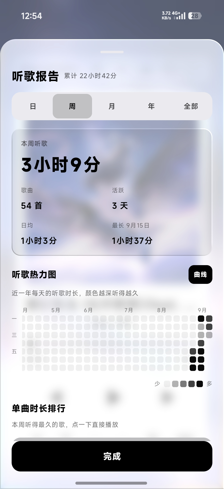

<picture>
  <source media="(prefers-color-scheme: dark)" srcset="https://img.shields.io/badge/IRIS-Music-00F0FF?style=for-the-badge&logo=music&logoColor=00F0FF&labelColor=0d0d12">
  
</picture>

### 一个本地音乐播放器

真·折射液态玻璃 · 三种排布 · 可自定义配色 · 不联网 · 无账号

*做自己想用的播放器*

[功能](#-功能) · [安装](#-安装) · [许可](#%EF%B8%8F-许可) · [免责声明](REMIND.md)

---

IRIS Music 是个**个人项目**：没有团队、没有 KPI，也不商业化。它只做我想要的样子——把手机里的音乐用简单卡片铺开，数据全部留在本机。

> ⚠️ 请先阅读 [`REMIND.md`](REMIND.md)（许可与免责声明）。本软件按 **AS IS** 提供，**无任何担保**。

## ✨ 功能

| | |
|:--|:--|
| 🎨 **各种主题** | 黑白 + 霓虹粉 / 深海蓝 / 青草绿三套彩色，外加**自定义**——取色器任意调主色 / 次色，实时生效；再叠加深色 / 浅色 / 自动明暗。 |
| 🧠 **本地推荐算法** | 大多数本地播放器都没有。基于点赞、播放次数、跳过、风格加权打分，对整个曲库独立算推荐度，还能调「探索度」在投其所好和探索新歌之间权衡。 |
| 🧭 **一库三排** | 纵向 / 横向 / 堆叠。排布、配色、明暗、材质各自独立一维，任意组合、不硬编码。 |
| ✨ **新奇功能** | 低音马达随心跳震动、一年听歌时长热力图报告、频响图上直接拖锚点的均衡器、果冻弹性动效…… |

> 🔒 **它不上网。** 清单里没有 `INTERNET` 权限——歌单、收藏、听歌统计全部只留在本机，安全、无广告、无遥测。

## 📸 截图

<table>
<tr>
<td align="center"> 歌单</td>
<td align="center"> 播放卡片</td>
<td align="center"> 播放卡片</td>
</tr>
<tr>
<td align="center"> 播放卡片 · 堆叠</td>
<td align="center"> 听歌报告</td>
<td></td>
</tr>
</table>

## 📥 安装

去 **[Releases](../../releases/latest)** 下载 `IRISMusic-v3.3.0-arm64-v8a.apk`（绝大多数近几年的手机，arm64），直接安装。

首次打开授予「读取音频」权限即可；若要用悬浮歌词，需在系统设置里手动授予「显示在其他应用上层」。

## ⚖️ 许可

Copyright © 2026 **WWRJ**.

本项目的**自有源码**在 **GNU General Public License v3.0**（[`LICENSE`](LICENSE)）下授权。简言之：**自由使用、修改、分发皆可；一旦你把修改版对外分发，整个衍生作品必须同样以 GPL-3.0 开源。** 详见 [`REMIND.md`](REMIND.md) 与 [`NOTICE`](NOTICE)。

本项目不含任何音乐内容；导入的音频由使用者自行负责。

Made with 🎧 by WWRJ
